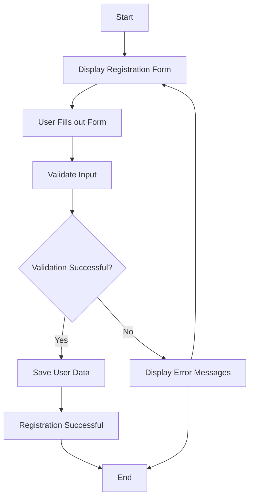

# sec_a_yogeshwaran.govindaraj__corejava_project_2
##**Blood**

## *Milestone[enter link description here](https://github.com/fssa-batch3/sec_a_yogeshwaran.govindaraj__corejava_project_2/milestones)

###ER diagram [https://freeimage.host/i/HDDUHsn](https://freeimage.host/)

### Attributes

-   name
-   email
-   password
-   address
-   employee id

### Validation

-   validation user
-   validation name
-   validation email
-   validation password

### Test

-   testvalidationUser
-   testvalidationname
-   testValidationemail
-   testValistionPassword

### DAO:

-   createUser

### Service:

-   registerUser

### Test:

TestRegisterFeature

-   testRegistrationSuccess

**Flow :**

User Module :
Add a user:
Allows to register new users.
Update user details:
Enables to modify user information such as name, password, etc.
Remove a user:
Allows to remove a user.
Show a list of all registered users.
